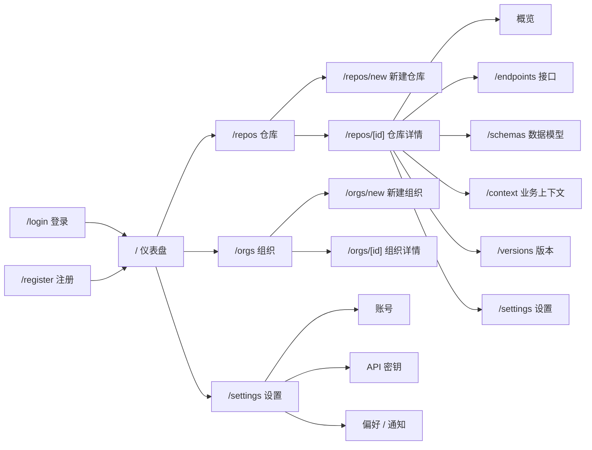

# Apigent Platform 页面设计（V0）

> 唯一设计文档 · 中文版 · V0

本文档定义 `apps/platform`（面向开发者的 Apigent 平台 Web 应用）的页面架构与用户体验设计，目标是在 V0 范围内做到**简单、易用、可引导**：新用户能在 10 分钟内完成「注册 → 创建组织 → 导入 OpenAPI → 浏览接口 → 生成密钥 → 接入 Agent」的完整闭环。

---

# 1. 设计目标与原则

## 1.1 设计目标

| 目标 | 说明 |
| --- | --- |
| 新手可上手 | 不需要阅读文档即可完成第一次导入和接入 |
| 核心任务优先 | 导入、浏览、接入 MCP 是最高频路径，任何页面不得让用户迷失 |
| 状态可见 | 导入进度、AI 生成状态、MCP 启用状态、密钥生命周期全程可见 |
| 渐进披露 | 高级功能（版本对比、业务上下文编辑、权限管理）折叠，不干扰主流程 |
| 一致可预期 | 同一类操作在全局保持相同位置、样式与交互 |

## 1.2 用户体验原则

1. **一屏一任务**：每个页面只回答一个问题，例如「现在有哪些仓库？」「这个接口的业务含义是什么？」
2. **空状态即引导**：没有数据时，页面直接告诉用户下一步该做什么，而不是显示空白表格。
3. **主操作唯一**：每个页面右上角只有一个主按钮；次要与危险操作进入「更多」菜单。
4. **先看后点**：列表行即详情入口，点击整行进入详情，避免「找到行 → 找按钮」的二次思考。
5. **错误可恢复**：所有失败操作给出原因与重试入口，禁止静默失败。
6. **权限驱动界面**：用户看不到自己没有权限的操作按钮，而不是点击后报错。

---

# 2. 用户与核心任务

## 2.1 用户画像

| 角色 | 目标 | 频率 |
| --- | --- | --- |
| API 开发者 | 导入 OpenAPI、浏览接口、查看业务上下文、更新版本 | 高 |
| 团队负责人（org_admin/owner） | 创建组织、管理成员、管理仓库、生成密钥 | 中 |
| AI Agent（经 MCP） | 搜索与读取 API 知识（不直接使用本界面） | — |

## 2.2 核心任务流（V0）

```
注册/登录
  → 仪表盘引导清单
  → 创建组织（若无）
  → 新建仓库 + 导入 OpenAPI
  → 查看接口与业务上下文
  → 生成 API 密钥
  → 复制 MCP 配置，接入 Cursor / Claude
```

日常循环：

```
搜索/浏览接口 → 查看业务上下文 → 调用或接入 → 更新版本 → 对比变更
```

---

# 3. 信息架构

## 3.1 站点地图



## 3.2 页面清单

> 线框实现位于 `design/platform/`（目录页：`index.html`），与本文档同步维护。

| 路由 | 页面 | HTML 文件 | 优先级 | 当前状态 |
| --- | --- | --- | --- | --- |
| `/login`、`/register` | 认证 | `login.html`、`register.html` | P0 | 已实现 |
| `/` | 仪表盘 | `dashboard.html` | P0 | 已实现（含引导清单） |
| `/repos` | 仓库列表 | `repos.html` | P0 | 已实现（真实数据） |
| `/repos/new` | 新建仓库向导 | `repo-new.html` | P0 | 创建已实现；OpenAPI 导入在仓库详情页提供 |
| `/repos/[id]` | 仓库详情（独立布局） | `repo-detail.html` | P0 | 已实现（总览 / 导入 / 密钥 / MCP 开关）；definition/context 为独立分区 |
| `/repos/[id]/definition` | 定义（接口 / 模型 / 组件） | `repo-defs.html` | P0 | 设计稿已定（Apifox 式单页）；待实现并收敛 endpoints / schemas |
| `/repos/[id]/context` | 业务上下文 | `repo-context.html` | P1 | 已实现（查看 / 生成 / 编辑） |
| `/repos/[id]/versions` | 版本历史与对比 | `repo-versions.html` | P1 | 设计稿已定（Phase 4，见 4.4.4）；版本列表 / 对比 / 回滚 / 导出待实现 |
| `/repos/[id]/settings` | 仓库设置 | `repo-settings.html` | P1 | 占位（空态壳）；仓库级设置未实现 |
| `/orgs`、`/orgs/new` | 组织列表/新建 | `orgs.html` | P0 | 已实现 |
| `/orgs/[id]` | 组织详情（成员/仓库） | `org-detail.html` | P1 | 设计稿已定（见 4.8.2），待实现 |
| `/settings` | 设置（账号 / API 密钥 / 偏好 / 通知） | `account-settings.html` | P0 | 账号、API 密钥、偏好（语言/主题）、通知（通知偏好）已实现 |
| `/search` | 语义搜索 | —（V1） | P2（V1） | 未实现 |
| `/projects` | 项目（跨仓库聚合） | —（V1） | P2（V1） | 未实现 |

## 3.3 导航设计

侧边栏（`AppSidebar`）调整为按**使用频率**排序：

1. **仪表盘** —— 状态与引导
2. **仓库** —— 核心对象，日常高频
3. **组织** —— 租户与成员管理（低频）
4. **API 密钥** —— 接入凭证（低频但关键）

**分组（V0）：** 按功能域轻分组：

- **仪表盘**：置顶且不设分组名（平台入口）
- **工作台**：组织、仓库（组织为仓库的租户容器，按领域层级排列）
- **API 密钥**：从侧栏移除，并入设置页（见 4.10），不占用一级导航

V1 条目增多（项目、语义搜索、知识图谱）后可扩为 3~4 组：工作台（仪表盘、语义搜索）、API 资产（仓库、项目）、组织与协作（组织）、接入与安全（MCP 接入）。原则：单条目组不划算，分组宁可少而稳；系统/账号级操作不进侧栏分组（留在顶栏与设置页）。

侧栏左下角保留「设置」常驻入口（桌面应用惯例，可发现性好），API 密钥管理已并入该页；用户身份细节（姓名/邮箱）与退出登录仍在顶栏用户菜单，系统快捷设置（主题/语言）在顶栏 ⚙。

**资源详情页例外（仓库详情等）：** 进入仓库后，左侧从「平台全局导航」切换为「仓库级导航」（返回仓库列表 + 仓库信息 + 概览/接口/数据模型/业务上下文/版本/设置），水平 Tab 移入左侧变为纵向分区，为内容区腾出空间；全局导航通过顶栏与「返回仓库列表」可达（详见 4.4）。

**账号操作的放置原则：** 退出登录、语言切换等系统/账号级操作统一收拢到全局顶栏（见 3.4），保持随时可达，不放入设置页；个人资料与密码修改放在独立的「账号设置」页（见 4.10），入口为顶栏用户菜单。

## 3.4 全局顶栏

在「侧边栏 + 内容区」之外增加一条横向全局菜单，承载系统级与账号级操作，全站保持一致：

| 区域 | 内容 |
| --- | --- |
| 左侧 | 全局搜索入口（V1） |
| 右侧 · 通知 | 铃铛 + 未读角标；下拉按业务分类分组（导入/上下文/密钥/MCP/系统）、按优先级排序，点击跳转对应页面并标记已读（通用通知设计见 `docs/modules/async-queue.md` §4） |
| 右侧 · 系统设置 | 主题（浅色/深色）、语言（中文/English）、版本信息 |
| 右侧 · 用户 | 个人信息、设置、退出登录 |

设计原则：侧边栏只承担工作区导航；与「组织 / 仓库」无关的系统与账号操作全部收拢到顶栏，避免导航区混杂。

**设置分层：** 顶栏 ⚙ 只放轻量快捷设置（主题、语言、关于）；完整设置（个人资料、密码、偏好及未来新增项）统一放在「账号设置」页（见 4.10）。弹窗仅用于瞬时轻操作（创建、确认、一次性输入），不承载会长大的设置内容。

> 调整理由：当前顺序（仪表盘/组织/仓库/密钥）把低频的「组织」放在高频的「仓库」之前；仓库才是用户每天面对的对象，应紧随仪表盘。

---

# 4. 页面设计

## 4.1 认证页（/login、/register）

**目标**：最快进入平台，注册后无缝引导。

- 居中卡片布局：品牌标识 + 标题 + 描述 + 表单。
- 登录：邮箱 + 密码；注册：姓名 + 邮箱 + 密码（至少 8 位）。
- 注册成功后自动登录并跳转仪表盘，由仪表盘的引导清单接管下一步。
- 错误提示内联显示（邮箱已注册、凭证错误等），不跳转不刷新。

## 4.2 仪表盘（/）

**目标**：新用户看到「该做什么」，老用户看到「平台状态」。

```
┌──────────────────────────────────────────────┐
│ 仪表盘                      [新建仓库]        │
│ API 知识平台概览                              │
├──────────────────────────────────────────────┤
│ 引导清单（未完成时显示）                       │
│ ✔ 创建组织   ○ 导入 OpenAPI  ○ 生成密钥       │
├──────────┬──────────┬──────────┬─────────────┤
│ 组织 3    │ 仓库 5   │ 接口 128 │ MCP 启用 2  │
├──────────┴──────────┴──────────┴─────────────┤
│ 最近更新                           快捷操作   │
│ · 支付服务 v2.1 · 昨天             创建仓库   │
│ · 用户中心 v1.3 · 3 天前           创建组织   │
│                                      更多 →  │
└──────────────────────────────────────────────┘
```

内容区块（按优先级）：

1. **引导清单（onboarding checklist）**：未完成核心步骤时显示，完成一项即打勾；全部完成后隐藏。步骤：创建组织 → 创建仓库 → 导入 OpenAPI → 生成密钥。
2. **统计卡**：组织数、仓库数、接口数、MCP 启用数。数字可点击跳转到对应列表。
3. **最近更新**：按 `updatedAt` 展示最近变更的仓库（含版本号与时间），点击进详情。
4. **接入 Agent 卡片**：展示 MCP 接入方式（服务地址 + 配置片段 + 复制按钮），放在统计卡下方，鼓励「导入后立即接入」。

## 4.3 仓库列表（/repos）

**目标**：快速找到仓库并进入详情。

- 页面头部：标题 + 描述，右上角主按钮「新建仓库」。
- 工具栏：关键字搜索框、组织筛选下拉、MCP 状态筛选。
- 表格列：仓库（名称 + 描述）｜组织｜接口数｜当前版本｜MCP 状态徽章｜更新时间｜操作（详情）。
- 整行可点击进入详情；「MCP」列使用绿/灰徽章（已启用/未启用）。
- 空状态：图标 + 「暂无仓库」+ 说明 + 「新建仓库」主按钮。
- 支持 URL 参数 `?org=slug` 预筛选（组织页跳转进入时生效），并在工具栏显示当前筛选与清除入口。

## 4.4 仓库详情（/repos/[id]，核心页面）

**目标**：一个仓库的所有信息与操作，无需离开当前上下文。

### 4.4.1 头部

- 面包屑：仓库 / 仓库名。
- 标题行：仓库名 + 组织徽章 + 当前版本号 + MCP 开关。
- 主操作：**导入新版本**；次要操作：更多菜单（编辑信息、删除仓库）。
- MCP 开关带说明文案与确认对话框：关闭会立即停止 Agent 对该仓库的访问。
- **导入新版本**：打开两阶段对话框（输入 → 预览 → 确认 → 成功）。预览阶段只解析不落库，展示接口/模型/模块统计与解析问题（文档级错误阻断，单接口问题宽容）；确认后创建不可变版本快照（`repo_versions` + 该版本下的接口/模型/模块/响应，`current_version_id` 指针切换到新版本），旧快照保留可回滚；成功页给出「查看接口 / 生成密钥」出口。

> **异步化设计（已确认，见 `docs/modules/async-queue.md`）**：导入采用异步任务 —— 提交后立即返回 `taskId`（202），解析/落库由队列 Worker（V0 默认 Postgres 队列，可配置切换 BullMQ + Redis）后台执行；导入对话框展示进度轮询（2s），结果通过顶栏消息通知（导入成功/失败，点击跳转新版本）+ 仓库详情状态徽章（进行中 / 失败可重试）呈现。失败重试复用已落盘的 spec 原文，无需重新上传；同一仓库存在进行中任务时返回 409 防重复导入。接口契约保持兼容：提交返回任务 ID 与状态查询入口（`GET /api/repos/:id/import-tasks/:taskId`）。

### 4.4.2 分区结构（左侧仓库导航）

仓库详情使用独立布局：左侧为仓库级导航（仓库信息、仓库分区菜单），替代全局侧栏与水平 Tab；左下角仅保留「返回仓库列表」按钮（设置入口不放此处，仍经顶栏用户菜单可达）。分区如下：

| 分区 | 内容 |
| --- | --- |
| 概览 | 描述、能力上下文卡片（AI 生成，可重新生成）、统计（接口/模型/版本）、MCP 接入面板、最近版本 |
| 定义（接口 / 模型 / 组件） | 单页 `/repos/[id]/definition`，参考 Apifox：接口 + 数据模型 + 组件库同树浏览，见 4.5.3 |
| 业务上下文 | 仓库级能力上下文（意图/约束/副作用/使用场景）查看与编辑，生成状态可见 |
| 版本 | 版本历史表 + 版本对比入口 |
| 设置 | 基本信息编辑、MCP 开关、危险区（删除仓库需输入名称确认） |

### 4.4.3 概览页线框

```
┌────────────────────────────────────────────────┐
│ ‹ 仓库  /  支付服务 API         [导入新版本] [⋯] │
│ 电商平台团队 · v2.1 · MCP [已启用]             │
├────────────────────────────────────────────────┤
│ 能力上下文                                      │
│ 支付服务提供订单支付、退款、对账能力。          │
│ 退款仅限支付后 7 天内；退款需原路返回。        │
│                                [重新生成]      │
├──────────┬──────────┬──────────┐               │
│ 接口 42  │ 模型 18  │ 版本 6   │  MCP 接入     │
├──────────┴──────────┴──────────┤  URL + 配置   │
│ 最近版本                        │  [复制]       │
│ v2.1 · 3 天前                   │               │
└────────────────────────────────┴───────────────┘
```

### 4.4.4 版本管理（/repos/[id]/versions，Phase 4）

**入口**：仓库 rail「版本」（计数徽章，`repo-versions.html` 线框已定）。

**版本历史表**：版本｜导入时间｜来源｜接口数｜数据模型数｜操作。

- 统计列（接口数 / 数据模型数）**实时 count，不落库**（V0 数据量小）。
- 操作列：
  - **当前版本**：`当前` 徽章 ＋ 「对比上一版本」＋「导出」。
  - **非当前版本**：「设为当前」（**二次确认**）＋「对比上一版本」＋「导出」。
  - 所有行可点击进入该版本（深链 URL 可分享）。

**版本对比（纯规则，不依赖 LLM）**：

- 支持**任意两版本对比**，URL 用 `?from=<versionId>&to=<versionId>` 可分享 / 恢复；默认提供「对比上一版本」快捷按钮。
- Diff 引擎做结构对比（`paths` / `components.schemas` / `components.*`），计算 **新增 / 修改 / 删除**，并按语义判定 **兼容 / 非破坏 / 破坏性**。
- 展示：顶部摘要徽章（新增 n / 修改 n / 删除 n / 破坏性 n）＋ 变更表（方法｜路径｜变更说明｜影响徽章）。
- 变更明细可沉淀到 `operation_log_details`，供版本对比与审计复用。

**设为当前（即回滚）**：

- 只切换 `repositories.current_version_id` 指针，版本快照**不可变**；不复制 / 不修改旧快照。
- 必须**二次确认**，弹窗提示：`切换后，外部 Agent 将读取该版本的接口定义。确定设为当前版本吗？`
- 成功后：版本表重新标记当前版本 ＋ 顶栏通知 ＋ 各页面读取到新 `current_version_id`。

**导出**：

- 按**数据库结构化内容**重新合成 OpenAPI JSON / YAML 下载（非原始导入文件），确保反映库中当前定义。

**权限（RBAC）**：

| 操作 | 最低角色 |
| --- | --- |
| 浏览 / 对比 / 导出 | `repo_viewer` |
| 导入新版本 | `repo_editor` |
| 设为当前（回滚） | `repo_admin` ＋ 二次确认 |

## 4.5 接口列表与详情（/repos/[id]/endpoints）

### 4.5.1 接口列表

- 工具栏：搜索（路径/摘要/operationId）、方法筛选、模块（tag）筛选、业务上下文状态筛选（已生成/未生成）。
- 表格列：方法（彩色徽章）｜路径｜摘要｜模块｜业务上下文状态｜操作。
- 方法配色（全站统一）：`GET` 绿、`POST` 蓝、`PUT` 琥珀、`PATCH` 紫、`DELETE` 红。
- 未生成业务上下文的接口行显示「待生成」标记，作为 AI 流程的进度可见性。
- 点击行在右侧**内嵌详情面板**展示接口详情（保留列表上下文，符合「一屏一任务」）。

### 4.5.2 接口详情（内嵌分栏页）

此面板为 `/repos/[id]/endpoints` 页面右侧的内嵌详情区，与左侧接口列表同屏展示，无需关闭按钮。

```
┌────────────────────────────────────────────────────┐
│ GET  /v1/orders/{id}/refund                      │
│ 申请订单退款                                        │
├──────────────────────────┬─────────────────────────┤
│ 请求 Schema               │ 业务上下文               │
│ · order_id: string        │ 意图：对已支付订单退款    │
│ · amount: number          │ 约束：仅支付后 7 天内     │
│ · reason: string          │ 副作用：原路退回资金      │
│ ─────────────────         │ 使用场景：…              │
│ 响应 Schema               │                         │
│ 200 → RefundResult        │ 关联接口                 │
│ 400/404/409 错误定义       │ · POST /payments/refund │
├──────────────────────────┴─────────────────────────┤
│ MCP 工具名：order_refund · [复制调用示例]           │
└────────────────────────────────────────────────────┘
```

内容组织：

- 左列：请求/响应 Schema（JSON ↔ 表格视图切换，可折叠）。
- 右列：业务上下文（意图、约束、副作用、使用场景）+ 关联接口列表（可点击跳转）。
- 底部：MCP 工具名与调用示例，一键复制 —— 这是「面向 Agent」产品与普通 API 文档的最大差异点，必须放在显眼位置。

### 4.5.3 API 定义（/repos/[id]/definition，参考 Apifox，单页）

接口与数据模型合并到同一个「定义」页（`/repos/[id]/definition`），左侧一棵树统一浏览、右侧内联详情——展示形式更接近 Apifox 的「接口管理」；模型、组件不再分散成独立子路由。

**左侧树结构（三个顶级分组）**

| 顶级分组 | 子项 | 对应 OpenAPI |
| --- | --- | --- |
| 接口 | 按 tag 分目录（宠物 / 店铺 / 用户…）→ 接口（方法 + 摘要） | `paths` |
| 数据模型 | schema 列表（字段树） | `components.schemas` |
| 组件库 | 响应组件（可复用 responses）、鉴权组件（securitySchemes）、参数组件、默认模板 | `components.responses` / `securitySchemes` / `parameters` 等 |

**右侧详情**：接口 → 方法 / 路径 / 摘要 / operationId / 模块 / 鉴权 + 参数 + 请求体 + 响应 + 业务上下文；数据模型 → Schema 字段树；响应组件 → 状态码 + 媒体类型 + Schema；鉴权组件 → 类型（http / apiKey / oauth2）+ 参数；参数 / 模板组件 → 定义。

**组件实现方式（与 `components.schemas` 同构）**：解析器从 `components.*` 提取可复用组件，落库到与 `data_models` 同构的组件表（`version_id` + `repo_id` + `kind` + `name` + JSON payload；`def_type` 为展示型类型提示，如 securityScheme → http / apiKey / oauth2），随版本快照写入，按 `kind` 分组展示。

**仓库级导航**：左侧 rail 在「概览」下新增**定义**分组，含单个子项「接口管理」（count = 接口 + 模型 + 组件，参考 Apifox 的入口命名），指向本页；接口、模型、组件不再分散成独立子路由。

**深链 / 分享**（可选：独立子路径，便于复制 URL 恢复视图）：

| 路径 | 状态 |
| --- | --- |
| `/repos/[id]/definition` | 定义页默认（无选中） |
| `/repos/[id]/definition/endpoints/[endpointId]` | 定位到指定接口 |
| `/repos/[id]/definition/schemas/[schemaId]` | 定位到指定数据模型 |
| `/repos/[id]/definition/components/[componentId]` | 定位到指定组件 |

上述子路径都渲染同一 `DefinitionView`，由路由参数决定初始选中并高亮左树对应节点；树中切换节点时更新 URL，保证可分享、可恢复。

## 4.6 新建仓库向导（/repos/new）

**目标**：把「创建 + 导入」做成一个三步向导，避免新用户分不清先后。

| 步骤 | 内容 |
| --- | --- |
| 1 基本信息 | 组织（无组织时内联「创建组织」）、名称、描述 |
| 2 导入 OpenAPI | 上传文件（拖拽）/ 粘贴 JSON/YAML / URL；解析校验即时反馈，错误内联展示 |
| 3 确认与结果 | 解析预览（接口数、模型数、模块数）→ 提交 → 成功页：查看接口 / 启用 MCP / 生成密钥 三个出口 |

要点：

- 步骤 2 支持三种导入方式并存，任选其一；校验错误就地提示（如版本不支持、YAML 语法错误），不打断流程。
- 成功页给出「下一步」而非「完成」，把用户推向 Agent 接入。

## 4.7 API 密钥（并入 /settings?section=keys）

**目标**：安全、清晰、一次性展示凭证。

### 4.7.1 密钥列表

- 页面头部 + 主按钮「生成新密钥」。
- 表格列：名称｜前缀｜权限范围（徽章）｜最近使用｜过期时间｜操作（吊销）。
- 空状态：说明 + 「生成新密钥」主按钮。

### 4.7.2 生成密钥对话框

1. 名称 + 权限范围（分组勾选）：
   - API 访问：`api:read`、`api:write`
   - MCP 访问：`mcp:search`、`mcp:detail`、`mcp:context`
2. 有效期（可选）。
3. 提交后进入**一次性展示**弹窗：完整密钥 + 复制按钮 + 明确警示「此密钥仅显示一次，关闭后无法再次查看」，并提示「请保存在你的密码管理器中」。

### 4.7.3 使用示例

密钥页底部提供可折叠的接入示例：

- MCP 配置（`claude_desktop_config.json` 片段，含密钥占位符）。
- curl 调用示例（`Authorization: Bearer <key>`）。

## 4.8 组织（/orgs、/orgs/new、/orgs/[id]）

### 4.8.1 组织列表

- 表格列：名称｜标识符（slug）｜成员数｜仓库数｜操作（查看仓库）。
- 空状态：引导创建第一个组织。

### 4.8.2 组织详情（V0 设计稿已定，待实现）

- Tab：概览（统计）/ 成员（邀请、角色变更、移除）/ 仓库 / 设置。
- 概览：仓库数 / 成员数 / 接口总数统计卡 + 仓库概览与成员概览两块卡片。
- 成员：表列出成员、邮箱、角色；操作列支持**角色变更**（owner / admin / member）与移除；owner 不可直接移除，需在设置转移所有权；仅 owner/admin 可见「成员」Tab 与「邀请成员」。
- 仓库：列出组织内仓库（接口数、当前版本、MCP 状态），可跳转仓库详情或新建。
- 设置：组织基本信息（名称、描述）+ **转移所有权**（危险区，二次确认，不可撤销）。
- 角色说明与权限继承按 `docs/tech-design.md` 2.8 的 RBAC 模型呈现。

## 4.9 语义搜索（/search，V1 预留）

- 顶部全局搜索入口（侧栏或顶栏）。
- 结果页：自然语言查询输入 → 语义匹配结果卡片（方法 + 路径 + 摘要 + 匹配理由 + 置信度）。
- 结果卡片可展开为接口详情（复用 4.5.2 内嵌详情展示）。

---

## 4.10 设置（/settings，独立一级菜单）

**目标**：集中管理账号、API 密钥与偏好。设置页使用与仓库详情一致的「独立一级菜单」布局，菜单分为两组：

- **用户信息**：账号（个人资料/修改密码）、API 密钥（列表/生成/吊销/接入示例，从侧栏一级导航并入本页）。
- **偏好设置**：偏好（界面语言、主题，与顶栏快捷设置同步）、通知（通知偏好为 V0，含导入结果 / 业务上下文开关；会话管理、API 偏好为 V1 规划）。
- **入口**：侧栏左下角「设置」或顶栏用户菜单「设置」；左下角另设「← 返回仪表盘」按钮回到仪表盘。

> **深链 / 分享**：`/settings` → 重定向到 `/settings/account`；各分区独立路径 `/settings/account | keys | preferences | notifications`，便于其它入口精确跳转（如「生成密钥」→ `/settings/keys`）。

> 扩展性：设置类信息统一使用页面承载（可按分区扩展、有 URL 可直达）；后续新增设置直接加为左侧新分区，不改为弹窗。弹窗只用于瞬时轻操作（生成密钥、确认、一次性输入）。

---

# 5. 状态设计

## 5.1 空状态规范

所有空状态统一四要素：**图标 + 标题 + 说明 + 主操作**（可选次操作）。示例：

| 页面 | 标题 | 主操作 |
| --- | --- | --- |
| 仓库列表 | 暂无仓库 | 新建仓库 |
| 接口列表 | 暂无接口 | 导入新版本 |
| API 密钥 | 暂无密钥 | 生成新密钥 |
| 组织列表 | 暂无组织 | 新建组织 |

## 5.2 加载与异步状态

- 列表/详情使用骨架屏（`Skeleton` 组件），避免布局跳动。
- 导入 OpenAPI、业务上下文生成等异步任务：进度条或状态徽章（进行中/成功/失败），失败显示原因与「重试」。
- 破坏性操作（吊销密钥、删除仓库、关闭 MCP）：确认对话框；删除仓库要求输入仓库名。

## 5.3 错误状态

- 表单错误内联显示在字段下方。
- 请求失败使用 toast 提示 + 重试按钮。
- 权限不足：隐藏入口；极端情况下显示「无权限」说明页而非报错。

---

# 6. 交互与视觉规范

## 6.1 通用布局

- 页面头部固定模式：左侧标题 + 描述，右侧主操作按钮。
- 列表用紧凑表格；详情用宽松卡片与网格。
- 主按钮全站唯一；同一页面出现多个同级别操作时，其余降级为次要按钮。

## 6.2 组件复用

全部复用 `@apigent/ui` 已有组件：`Sidebar`、`Card`、`Table`、`Badge`、`Dialog`、`DropdownMenu`、`Input`、`Textarea`、`Button`、`Breadcrumb`、`Skeleton`、`Sheet`（移动端抽屉）、`Separator`。避免为单个页面自造样式。

## 6.3 方法色标

| 方法 | 颜色 |
| --- | --- |
| GET | 绿 |
| POST | 蓝 |
| PUT | 琥珀 |
| PATCH | 紫 |
| DELETE | 红 |

以 `Badge` 实现，全站统一。

## 6.4 响应式

- 桌面：固定侧栏 + 内容区。
- 移动端：侧栏收起为抽屉（`use-mobile` + `Sheet`），表格横向滚动，主操作保持可见。

## 6.5 键盘与快捷操作（V1）

- `/` 或 `Cmd+K` 聚焦全局搜索。
- `Esc` 关闭弹窗与抽屉。
- 列表页 `N` 新建（可选）。

---

# 7. 分阶段实施计划

| 阶段 | 范围 | 说明 |
| --- | --- | --- |
| P0 | 导航调整、仪表盘引导清单、仓库列表/详情真实数据、新建仓库向导、密钥生成/吊销流程、组织详情壳 | 与后端接口接通，替换当前占位 |
| P1 | 版本对比、业务上下文查看/编辑、全局搜索、MCP 接入引导（一键复制配置） | 体现「面向 Agent」差异价值 |
| P2（V1） | 项目、成员邀请流程、知识图谱可视化、使用洞察、命令面板 | 依赖 Project 模型与 V1 Agent |

## 实施顺序建议

1. 先接通**仓库列表 + 详情**（数据闭环），让现有占位变成可用。
2. 再做**新建仓库向导**与**密钥流程**，打通「导入 → 接入」主链路。
3. 最后补**仪表盘引导清单**与**组织详情**，完善引导与权限体验。

---

# 8. 成功指标

| 指标 | 目标 |
| --- | --- |
| 新用户首次完整闭环耗时 | < 10 分钟（注册 → 导入 → 生成密钥） |
| 导入成功率 | ≥ 95%，失败可定位可重试 |
| 空状态页 CTA 点击率 | 可观测并持续优化 |
| 关键路径页面跳出率 | 仓库详情页 > 60% 的访问继续浏览接口/上下文 |
| 接入转化 | 导入后的仓库 ≥ 60% 启用 MCP 或生成密钥 |

---

# 9. 待确认问题

- 仓库详情采用「Tab 页」还是「子路由独立页」？（本方案推荐 Tab 页 + 独立子路由，兼顾上下文与可分享 URL。）
- 接口详情采用「内嵌分栏页」而非「抽屉」（已确认：保留列表上下文、减少来回跳转，2026-09-05 定稿）。
- 是否需要 Workspace 概念（组织之上再聚合）？V0 默认不需要，避免层级过深。
