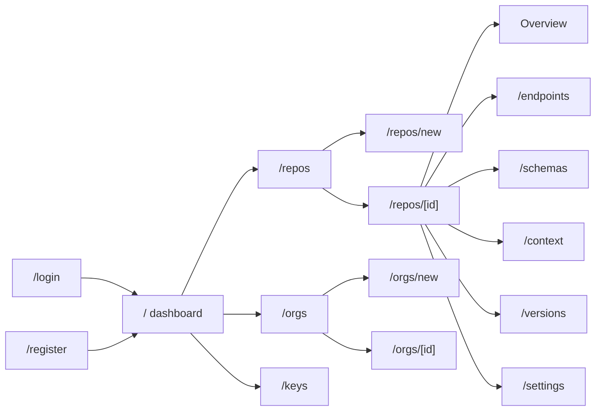

# Apigent Platform Page Design (V0)

> 🌐 Language: [English](./platform-ux.md) | [中文](./platform-ux.zh.md)

This document defines the page architecture and UX design for `apps/platform` — the developer-facing Apigent web application. The goal for V0 is to be **simple, usable, and guided**: a new user can complete the full loop — sign up → create an organization → import OpenAPI → browse endpoints → create an API key → connect an Agent — in under 10 minutes.

---

# 1. Design Goals & Principles

## 1.1 Goals

| Goal | Description |
| --- | --- |
| Beginner-friendly | First import and integration should not require reading documentation |
| Core tasks first | Import, browse, and MCP integration are the highest-frequency paths; no page may lose the user |
| Visible state | Import progress, AI generation status, MCP enablement, and key lifecycle are always visible |
| Progressive disclosure | Advanced features (version diff, business context editing, permission management) are collapsed and never interrupt the main flow |
| Consistent & predictable | The same kind of action appears in the same place with the same style everywhere |

## 1.2 UX Principles

1. **One screen, one task**: each page answers a single question, e.g. "What repositories exist?" or "What does this endpoint do?"
2. **Empty states are guidance**: when there is no data, the page tells the user what to do next instead of showing a blank table.
3. **One primary action**: each page has a single primary button in the top-right; secondary and destructive actions live in a "More" menu.
4. **See first, click later**: a list row is the entry to detail; click the row rather than hunting for a button.
5. **Recoverable errors**: every failure shows a reason and a retry path; no silent failures.
6. **Permission-driven UI**: users do not see buttons for actions they cannot perform, instead of clicking and getting an error.

---

# 2. Users & Core Tasks

## 2.1 Personas

| Role | Goal | Frequency |
| --- | --- | --- |
| API developer | Import OpenAPI, browse endpoints, read business context, update versions | High |
| Team lead (org_admin/owner) | Create organizations, manage members, manage repos, create keys | Medium |
| AI Agent (via MCP) | Search and read API knowledge (does not use this UI directly) | — |

## 2.2 Core flows (V0)

```
Sign up / sign in
  → dashboard checklist
  → create an organization (if none)
  → create a repository + import OpenAPI
  → browse endpoints and business context
  → create an API key
  → copy MCP configuration, connect Cursor / Claude
```

Daily loop:

```
Search / browse endpoints → read business context → call or integrate → release a new version → compare changes
```

---

# 3. Information Architecture

## 3.1 Sitemap



## 3.2 Page inventory

| Route | Page | Priority | Current state |
| --- | --- | --- | --- |
| `/login`, `/register` | Auth | P0 | Implemented |
| `/` | Dashboard | P0 | Implemented (needs checklist) |
| `/repos` | Repository list | P0 | Skeleton (data pending) |
| `/repos/new` | Create repository wizard | P0 | Form implemented (backend pending) |
| `/repos/[id]` | Repository detail (tabs) | P0 | Placeholder |
| `/repos/[id]/endpoints` | Endpoint list + detail | P0 | Not implemented |
| `/repos/[id]/schemas` | Data models | P1 | Not implemented |
| `/repos/[id]/context` | Business context | P1 | Not implemented |
| `/repos/[id]/versions` | Version history & diff | P1 | Not implemented |
| `/repos/[id]/settings` | Repository settings | P1 | Not implemented |
| `/orgs`, `/orgs/new` | Organization list/create | P0 | Implemented |
| `/orgs/[id]` | Organization detail (members/repos) | P1 | Not implemented |
| `/settings` | Settings (account / API keys / preferences / more) | P0 | Dedicated primary menu; key management merged in |
| `/search` | Semantic search | P2 (V1) | Not implemented |
| `/projects` | Projects (cross-repo) | P2 (V1) | Not implemented |

## 3.3 Navigation

Reorder the sidebar (`AppSidebar`) by **frequency of use**:

1. **Dashboard** — status and guidance
2. **Repositories** — the core object, daily use
3. **Organizations** — tenants and members (low frequency)
4. **API Keys** — credentials (low frequency, critical)

**Grouping (V0):** light functional grouping:

- **Dashboard**: pinned at the top with no group label (platform entry)
- **Workbench**: Organizations, Repositories (organizations are the tenant container of repositories; ordered by domain hierarchy)
- **API keys**: removed from the sidebar and merged into the settings page (see 4.10); no longer takes a primary-nav slot

As V1 adds items (Projects, semantic search, knowledge graph), expand to 3–4 groups: Workbench (Dashboard, semantic search), API Assets (Repositories, Projects), Organization & Collaboration (Organizations), Access & Security (MCP integration). Principles: single-item groups are rarely worth the label, so keep groups few and stable; system/account-level actions stay out of sidebar groups (they live in the top bar and settings page).

The sidebar bottom-left keeps a persistent "Settings" entry (desktop-app convention, good discoverability); API key management has been merged into that page. Identity details (name/email) and sign out stay in the top-bar user menu, and system quick settings (theme/language) stay in the top-bar gear menu.

**Resource detail pages are an exception (repository detail, etc.):** once inside a repository, the left side switches from the global platform navigation to repository-scoped navigation (back to repository list + repo info + Overview/Endpoints/Data models/Business context/Versions/Settings); the horizontal tabs move into the left rail as vertical sections, freeing up content space. Global navigation stays reachable via the top bar and the "back to repository list" entry (see 4.4).

**Placement rule for account operations:** sign out, locale switching, and other system/account-level actions are consolidated in the global top bar (see 3.4) and stay reachable at all times; they are not buried in a settings page. Profile and password changes live in a dedicated "Account settings" page (see 4.10), entered via the top-bar user menu.

## 3.4 Global top bar

A horizontal global menu sits above the "sidebar + content" shell and carries system- and account-level actions consistently across all pages:

| Area | Content |
| --- | --- |
| Left | Global search entry (V1) |
| Right · Notifications | Bell + unread dot; dropdown lists recent notifications |
| Right · System settings | Theme (light/dark), language (Chinese/English), version info |
| Right · User | Profile, settings, sign out |

Design principle: the sidebar is workspace navigation only; system and account actions unrelated to Organizations/Repositories live in the top bar so the navigation area stays clean.

**Settings layering:** the top-bar ⚙ holds only lightweight quick settings (theme, language, about); full settings (profile, password, preferences, and future items) live on the "Account settings" page (see 4.10). Dialogs are reserved for transient light actions (create, confirm, one-time input) and never host growing settings content.

> Rationale: the current order (Dashboard / Organizations / Repositories / Keys) places low-frequency Organizations before high-frequency Repositories; Repositories are what users face daily and should sit right after Dashboard.

---

# 4. Page Design

## 4.1 Auth (/login, /register)

**Goal**: get in fast; guide immediately after sign-up.

- Centered card: brand mark + title + description + form.
- Login: email + password; Register: name + email + password (min 8 chars).
- Auto-login after register and redirect to the dashboard, where the checklist takes over.
- Errors are inline (email taken, bad credentials) — no redirect or full reload.

## 4.2 Dashboard (/)

**Goal**: new users see "what to do", returning users see "platform status".

```
┌──────────────────────────────────────────────┐
│ Dashboard                    [New repository] │
│ API knowledge overview                       │
├──────────────────────────────────────────────┤
│ Checklist (shown until complete)             │
│ ✔ Create org   ○ Import OpenAPI  ○ Key      │
├──────────┬──────────┬──────────┬─────────────┤
│ Orgs 3   │ Repos 5  │ EP 128   │ MCP on 2    │
├──────────┴──────────┴──────────┴─────────────┤
│ Recent updates                    Quick      │
│ · Payments v2.1 · yesterday       actions    │
│ · Users v1.3 · 3 days ago         More →     │
└──────────────────────────────────────────────┘
```

Blocks, in priority order:

1. **Onboarding checklist**: shown until the core steps are done; each step gets a checkmark. Steps: create org → create repo → import OpenAPI → create key.
2. **Stat cards**: organizations, repositories, endpoints, MCP-enabled. Numbers link to their lists.
3. **Recent updates**: repositories ordered by `updatedAt` (with version and time), linking to detail.
4. **Connect an Agent card**: MCP endpoint + config snippet + copy button, below the stats to encourage immediate integration.

## 4.3 Repository list (/repos)

**Goal**: find a repository quickly and enter detail.

- Page header: title + description; primary button "New repository" top-right.
- Toolbar: keyword search, organization filter, MCP status filter.
- Table columns: repository (name + description) | organization | endpoints | current version | MCP badge | updated | actions (details).
- Whole row is clickable; MCP column uses green/gray badges (enabled/disabled).
- Empty state: icon + "No repositories" + description + "New repository" CTA.
- Support `?org=slug` pre-filter (arriving from the org page), shown in the toolbar with a clear filter + clear action.

## 4.4 Repository detail (/repos/[id], core page)

**Goal**: everything about one repository, without losing context.

### 4.4.1 Header

- Breadcrumb: Repositories / name.
- Title row: name + org badge + current version + MCP toggle.
- Primary action: **Import new version**; secondary: More menu (edit info, delete).
- The MCP toggle has explanatory copy and a confirmation dialog: disabling immediately stops Agent access to this repository.

### 4.4.2 Section structure (left repo nav)

Repository detail uses an independent layout: the left rail is repository-scoped navigation (repo info, repository section menu), replacing the global sidebar and horizontal tabs; the bottom-left keeps only the "Back to repository list" button (no settings entry here — settings remain reachable via the top-bar user menu). Sections:

| Section | Content |
| --- | --- |
| Overview | Description, capability context card (AI-generated, can regenerate), stats (endpoints/models/versions), MCP integration panel, recent versions |
| Endpoints | Endpoint list (see 4.5) |
| Data models | Model card grid; click opens a schema dialog |
| Business context | Repository-level capability context (intent/constraints/side effects/scenarios) view + edit, generation state visible |
| Versions | Version history table + diff entry points |
| Settings | Basic info edit, MCP toggle, danger zone (delete requires typing the repo name) |

### 4.4.3 Overview wireframe

```
┌────────────────────────────────────────────────┐
│ ‹ Repos  /  Payments API        [Import ver] [⋯] │
│ Ecommerce team · v2.1 · MCP [On]               │
├────────────────────────────────────────────────┤
│ Capability context                             │
│ Payments provides order payment, refund, and   │
│ reconciliation. Refund only within 7 days;     │
│ refunds return to the original channel.        │
│                                  [Regenerate]  │
├──────────┬──────────┬──────────┐               │
│ EP 42    │ Models 18│ Ver 6    │  MCP access   │
├──────────┴──────────┴──────────┤  URL + config │
│ Recent versions                │  [Copy]       │
│ v2.1 · 3 days ago              │               │
└────────────────────────────────┴───────────────┘
```

## 4.5 Endpoint list & detail (/repos/[id]/endpoints)

### 4.5.1 Endpoint list

- Toolbar: search (path/summary/operationId), method filter, module (tag) filter, business-context status filter (generated/not).
- Table columns: method (colored badge) | path | summary | module | context status | actions.
- Method colors (consistent site-wide): `GET` green, `POST` blue, `PUT` amber, `PATCH` purple, `DELETE` red.
- Rows without business context show a "pending" marker — visible progress for the AI pipeline.
- Clicking a row opens an **endpoint detail drawer** (keeps list context).

### 4.5.2 Endpoint detail (drawer or dedicated page)

```
┌────────────────────────────────────────────────────┐
│ GET  /v1/orders/{id}/refund                [Close] │
│ Refund an order                                    │
├──────────────────────────┬─────────────────────────┤
│ Request schema           │ Business context        │
│ · order_id: string       │ Intent: refund a paid   │
│ · amount: number         │   order                 │
│ · reason: string         │ Constraints: within 7d   │
│ ─────────────────        │ Side effects: refunds    │
│ Response schema          │   original channel       │
│ 200 → RefundResult       │ Scenarios: …            │
│ 400/404/409 errors       │                         │
│                          │ Related endpoints       │
│                          │ · POST /payments/refund │
├──────────────────────────┴─────────────────────────┤
│ MCP tool: order_refund · [Copy call example]       │
└────────────────────────────────────────────────────┘
```

Layout:

- Left column: request/response schema (JSON ↔ table view toggle, collapsible).
- Right column: business context (intent, constraints, side effects, scenarios) + related endpoints (clickable).
- Footer: MCP tool name and call example with one-click copy — this is the key differentiator of an Agent-first product and must be prominent.

## 4.6 Create repository wizard (/repos/new)

**Goal**: turn "create + import" into a three-step wizard so users never wonder about ordering.

| Step | Content |
| --- | --- |
| 1 Basic info | Organization (inline "create org" when none exists), name, description |
| 2 Import OpenAPI | Upload file (drag & drop) / paste JSON-YAML / URL; validation is instant, errors inline |
| 3 Confirm & result | Parse preview (endpoint/model/module counts) → submit → success page with three exits: view endpoints / enable MCP / create key |

Notes:

- Step 2 supports all three import modes side by side; validation errors are shown in place (unsupported version, YAML syntax) without breaking the flow.
- The success page says "next step" instead of "done", pushing users toward Agent integration.

## 4.7 API keys (/keys)

**Goal**: secure, clear, one-time credential display.

### 4.7.1 Key list

- Page header + primary button "Generate key".
- Table columns: name | prefix | scopes (badges) | last used | expires | actions (revoke).
- Empty state: description + "Generate key" CTA.

### 4.7.2 Generate dialog

1. Name + scope checkboxes grouped by surface:
   - API access: `api:read`, `api:write`
   - MCP access: `mcp:search`, `mcp:detail`, `mcp:context`
2. Optional expiry.
3. Submit opens a **one-time reveal** dialog: full key + copy button + clear warning "This key is shown only once" and "store it in your password manager".

### 4.7.3 Usage examples

Collapsible integration snippets at the bottom of the page:

- MCP config (`claude_desktop_config.json` fragment with a key placeholder).
- curl example (`Authorization: Bearer <key>`).

## 4.8 Organizations (/orgs, /orgs/new, /orgs/[id])

### 4.8.1 List

- Table columns: name | slug | members | repositories | actions (view repos).
- Empty state guides creation of the first org.

### 4.8.2 Organization detail (full in V1, shell in V0)

- Tabs: Overview (stats) / Members (invites, roles: owner/admin/member) / Repositories / Settings.
- Member management follows the RBAC model in `docs/tech-design.md` §2.8; the Members tab is visible only to owner/admin.

## 4.9 Semantic search (/search, V1)

- Global search entry (sidebar or top bar).
- Results page: natural-language query → semantic result cards (method + path + summary + match reason + confidence).
- Cards expand into endpoint detail (reusing the 4.5.2 drawer).

---

## 4.10 Settings (/settings, dedicated primary menu)

**Goal**: centralize account, API keys, and preferences. The settings page uses its own dedicated left menu (same pattern as repository detail), organized into two groups:

- **User info**: Account (profile/change password), API keys (list/generate/revoke/integration examples — moved in from the sidebar primary navigation).
- **Preferences**: Preferences (UI language, theme — synced with the top-bar quick settings), More (V1: notification preferences, session management, API preferences, etc.).
- **Entry**: "Settings" at the sidebar bottom-left or the top-bar user menu; a "Back to dashboard" button sits at the bottom-left.

> Extensibility: settings use a dedicated page (growable via sections, shareable URL); future additions become new left-menu sections rather than dialogs. Dialogs are reserved for transient light actions (generate key, confirm, one-time input).

---

# 5. State Design

## 5.1 Empty states

Every empty state has four elements: **icon + title + description + primary action** (optional secondary). Examples:

| Page | Title | Primary action |
| --- | --- | --- |
| Repository list | No repositories | New repository |
| Endpoint list | No endpoints | Import new version |
| API keys | No keys | Generate key |
| Organization list | No organizations | New organization |

## 5.2 Loading & async states

- Lists/details use skeletons (`Skeleton`) to avoid layout shifts.
- Async work (OpenAPI import, business-context generation) shows progress or a status badge (running/success/failed); failures show the reason and a retry.
- Destructive actions (revoke key, delete repo, disable MCP): confirmation dialog; deleting a repo requires typing its name.

## 5.3 Errors

- Form errors are inline under fields.
- Request failures use toasts with a retry action.
- Insufficient permissions: hide the entry; in edge cases show an "access denied" explanation instead of a raw error.

---

# 6. Interaction & Visual Guidelines

## 6.1 Common layout

- Page header pattern: title + description on the left, primary button on the right.
- Dense tables for lists; relaxed cards and grids for details.
- One primary button site-wide; additional equal-level actions degrade to secondary buttons.

## 6.2 Component reuse

Reuse `@apigent/ui` components: `Sidebar`, `Card`, `Table`, `Badge`, `Dialog`, `DropdownMenu`, `Input`, `Textarea`, `Button`, `Breadcrumb`, `Skeleton`, `Sheet` (mobile drawer), `Separator`. Avoid per-page custom styling.

## 6.3 Method colors

| Method | Color |
| --- | --- |
| GET | Green |
| POST | Blue |
| PUT | Amber |
| PATCH | Purple |
| DELETE | Red |

Implemented as `Badge`, consistent site-wide.

## 6.4 Responsive

- Desktop: fixed sidebar + content area.
- Mobile: sidebar collapses to a drawer (`use-mobile` + `Sheet`), tables scroll horizontally, primary actions stay visible.

## 6.5 Keyboard & shortcuts (V1)

- `/` or `Cmd+K` focuses global search.
- `Esc` closes dialogs and drawers.
- Optional `N` for new on list pages.

---

# 7. Phased Implementation

| Phase | Scope | Notes |
| --- | --- | --- |
| P0 | Navigation reorder, dashboard checklist, real repository list/detail data, create-repo wizard, key create/revoke flow, org detail shell | Wire to backend APIs; replace placeholders |
| P1 | Endpoint detail, version diff, business context view/edit, global search, MCP integration guide (one-click config copy) | Delivers the Agent-first differentiator |
| P2 (V1) | Projects, member invites, knowledge-graph visualization, usage insights, command palette | Depends on Project model and V1 agents |

Suggested order:

1. Wire up **repository list + detail** first (data loop) so placeholders become usable.
2. Then the **create-repo wizard** and **key flow** to complete the import → integrate path.
3. Finally the **dashboard checklist** and **org detail** for guidance and permission UX.

---

# 8. Success Metrics

| Metric | Target |
| --- | --- |
| Time to first full loop for new users | < 10 min (register → import → create key) |
| Import success rate | ≥ 95%, failures diagnosable and retryable |
| Empty-state CTA click rate | Observable, continuously optimized |
| Key-path bounce | > 60% of repo-detail visits continue to endpoints/context |
| Integration conversion | ≥ 60% of imported repos enable MCP or create a key |

---

# 9. Open Questions

- Repository detail: tabs vs. separate child routes? (This plan recommends tabs with separate child routes for shareable URLs.)
- Endpoint detail: drawer vs. dedicated page? (This plan recommends a drawer to reduce back-and-forth.)
- Is a Workspace concept needed above Organizations? V0 default: no, to avoid deep hierarchy.
